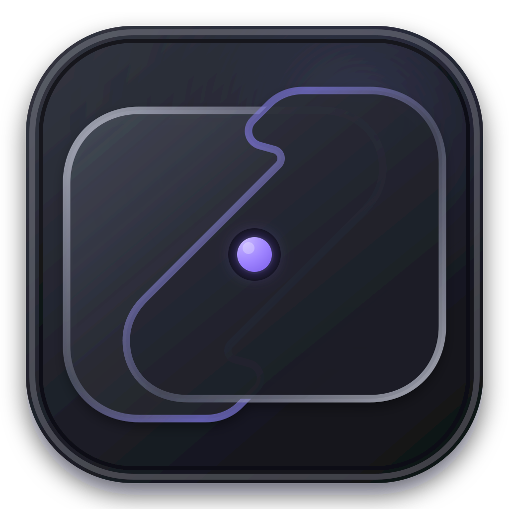
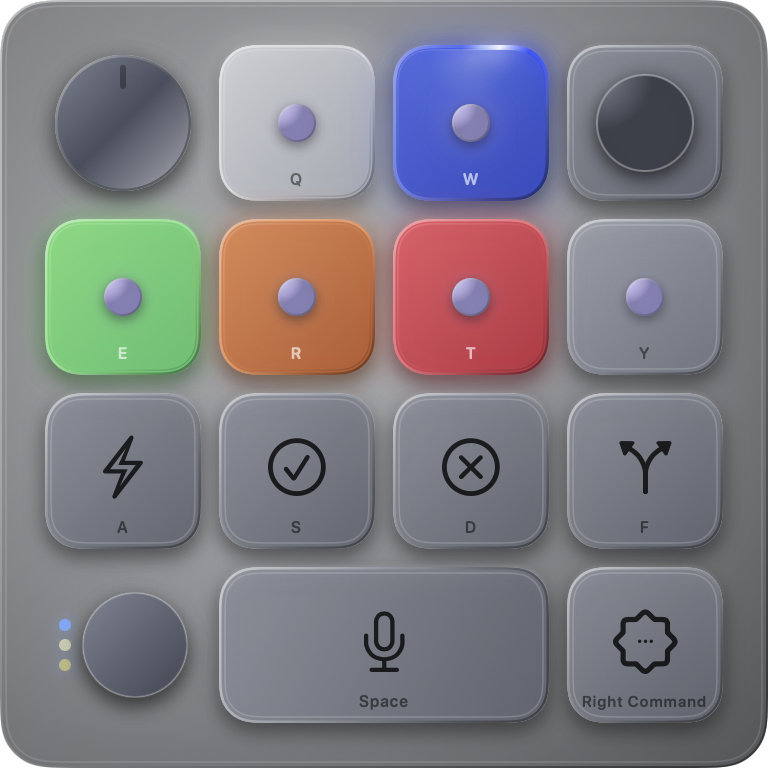
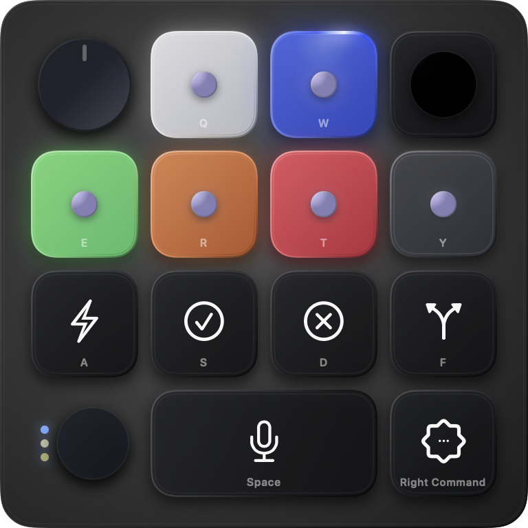

# KeySwitch

<p align="center">
  
</p>

[](https://github.com/Mohit-Patil/keyswitch/actions/workflows/ci.yml)
[](LICENSE)
[](https://support.apple.com/macos)
[](https://www.swift.org/)
[](https://github.com/Mohit-Patil/keyswitch/releases/latest)
[](https://mohit-patil.github.io/keyswitch/)

<p align="center">
  &nbsp;&nbsp;
  
</p>
<p align="center"><sub>Light appearance · Dark appearance</sub></p>

KeySwitch is a native macOS menu-bar app that turns the built-in keyboard into
an editable, Codex Micro-style control layer. Hold `Fn + Control` to activate
the default layer, use the mapped controls, and return to normal typing when
the layer exits.

See the interactive showcase at
[mohit-patil.github.io/keyswitch](https://mohit-patil.github.io/keyswitch/).

> [!IMPORTANT]
> KeySwitch is an independent, experimental project. It is not affiliated with
> or endorsed by OpenAI or any hardware vendor. Its Codex bridge relies on
> undocumented desktop-app behavior and can break after a Codex update.

## Highlights

- Editable Hold or Toggle activation, with `Fn + Control` as the safe default.
- A persistent mapping for every supported agent, command, stick, and dial
  control.
- A configurable six-agent status strip in the menu bar, plus a
  non-focus-stealing frosted HUD with four sizes for the active keyboard layer.
- Automatic synchronization of keycaps and slot actions from Codex Micro
  settings.
- Accessibility and keyboard-capture health checks with a direct link to macOS
  System Settings.
- Automatic inactivity exit, Escape safety exit, and optional blocking of
  unmapped keys while the layer is active.
- Optional native Launch at Login registration, managed through macOS Login
  Items without starting or controlling Codex.
- Signed background update checks with a one-click **Restart to Update** action
  once a new release is downloaded and ready.
- Static textured agent lighting by default, with continuous orbit and pulse
  animation available as an opt-in setting.
- Local settings only: no account system, analytics, or telemetry.

## Install

Download the
[latest universal installer](https://github.com/Mohit-Patil/keyswitch/releases/latest/download/KeySwitch-macOS-universal.dmg),
open it, and drag the signed and Apple-notarized `KeySwitch.app` onto the
Applications shortcut. The same installer runs on Apple Silicon and Intel
Macs. A
[ZIP archive](https://github.com/Mohit-Patil/keyswitch/releases/latest/download/KeySwitch-macOS-universal.zip)
is also available for managed or command-line installation.

On first launch, KeySwitch guides you through Accessibility and the optional
Codex connection. Release checksums and notes are available on
the [GitHub Releases page](https://github.com/Mohit-Patil/keyswitch/releases/latest).

## Requirements

- macOS 14 Sonoma or later.
- A compatible Codex desktop app installation for Codex Micro integration.
- Xcode 16 or later to build from source.
- Accessibility permission for global keyboard capture and temporary key
  suppression while the layer is active.
- [XcodeGen](https://github.com/yonaskolb/XcodeGen) only when regenerating the
  committed Xcode project from `project.yml`.

## Build from source

Clone the repository and run the test suite:

```sh
git clone https://github.com/Mohit-Patil/keyswitch.git
cd keyswitch
xcodebuild -project KeySwitch.xcodeproj -scheme KeySwitch \
  -configuration Debug -derivedDataPath .build/xcode \
  CODE_SIGNING_ALLOWED=NO test
```

For a locally signed build, open `KeySwitch.xcodeproj` in Xcode, select your
development team under **Signing & Capabilities**, and run the `KeySwitch`
scheme. Alternatively:

```sh
xcodebuild -project KeySwitch.xcodeproj -scheme KeySwitch \
  -configuration Debug -derivedDataPath .build/xcode build
open .build/xcode/Build/Products/Debug/KeySwitch.app
```

The repository intentionally does not include signing credentials, notarized
binaries, profiling traces, or local design-review captures. macOS privacy
permissions are tied to an app's identity and location, so unsigned rebuilds
may need their permissions granted again.

Official GitHub release builds can update themselves through Sparkle. Debug,
unsigned, and development-signed builds deliberately keep the updater disabled.

To regenerate the Xcode project after editing `project.yml`:

```sh
brew install xcodegen
xcodegen generate
```

Commit both `project.yml` and the regenerated `KeySwitch.xcodeproj` changes.

## First run

KeySwitch presents a three-step setup assistant:

1. Review the keyboard layer and activation shortcut.
2. Grant Accessibility permission.
3. Connect the installed Codex desktop app and open its Micro setup.

The connection step can restart the original Codex app once with a Chromium
debugging port enabled. It does not create another app bundle or an isolated
profile. KeySwitch then reconnects to that loopback port when the renderer
changes or Codex relaunches.

## Default mapping

The Mac keys map to physical Micro slots. The action assigned to each slot
continues to come from Codex.

| Mac key | Micro control | Event |
| --- | --- | --- |
| `Q` | Agent 1 | `AG00` |
| `W` | Agent 2 | `AG01` |
| `E` | Agent 3 | `AG02` |
| `R` | Agent 4 | `AG03` |
| `T` | Agent 5 | `AG04` |
| `Y` | Agent 6 | `AG05` |
| `A` | Fast mode | `ACT06` |
| `S` | Approve | `ACT07` |
| `D` | Reject | `ACT08` |
| `F` | Fork | `ACT09` |
| `Space` | Push to talk | `ACT10` |
| `Right Command` | Codex / Submit | `ACT12` |
| `I` | Stick up | Codex-configured action |
| `L` | Stick right | Codex-configured action |
| `K` | Stick down | Codex-configured action |
| `J` | Stick left | Codex-configured action |
| `Tab` | Dial previous | `ENC_CW` |
| `Backtick` | Dial next | `ENC_CC` |
| `Left Shift` | Dial press / hold | `ENC_PRESS` |

Every mapping and the activation shortcut can be changed in KeySwitch
Settings.

## How the Codex bridge works

KeySwitch discovers a Chromium renderer at `127.0.0.1:9348` by default and
uses its existing Micro event contracts. It reads the six agent-slot states,
the current Micro layout, keycaps, and selected control modes; it then sends
key, joystick, and encoder events for the fixed hardware slots.

The bridge:

- connects only to the configured loopback address from KeySwitch;
- leaves action assignment inside Codex;
- retries every two seconds while disconnected;
- is not USB HID emulation; and
- uses undocumented renderer state that is not a stable public API.

Do not expose the debugging port to another network interface. See
[Privacy](docs/PRIVACY.md) and [Security](SECURITY.md) for the trust boundaries.

## Architecture

```text
Global keyboard event tap
          │
          ▼
    KeyboardEngine ─────► AppModel ─────► Frosted HUD
          │                  │
          │                  ▼
          └──────────► CodexMicroBridge ─► 127.0.0.1 debug target
```

See [Architecture](docs/ARCHITECTURE.md) for component ownership, state flow,
and trust boundaries.

## Project status

KeySwitch is early-stage software. The keyboard engine and configuration
migrations have unit coverage, but compatibility with Codex is inherently
best-effort because the integration is undocumented. Please include macOS and
Codex versions when reporting bridge issues.

## Contributing and support

- Read [CONTRIBUTING.md](CONTRIBUTING.md) before opening a pull request.
- Use [GitHub Discussions](https://github.com/Mohit-Patil/keyswitch/discussions)
  for questions and ideas.
- Use the structured issue forms for reproducible bugs and feature proposals.
- Report vulnerabilities privately according to [SECURITY.md](SECURITY.md).
- Community participation is governed by [CODE_OF_CONDUCT.md](CODE_OF_CONDUCT.md).

## License

KeySwitch is available under the [MIT License](LICENSE).

The bundled Sparkle updater and its notices are documented in
[`ThirdPartyNotices.txt`](KeySwitchApp/Resources/ThirdPartyNotices.txt).

All third-party product names, trademarks, and registered trademarks are the
property of their respective owners. Their use is descriptive and does not
imply affiliation, sponsorship, or endorsement.
